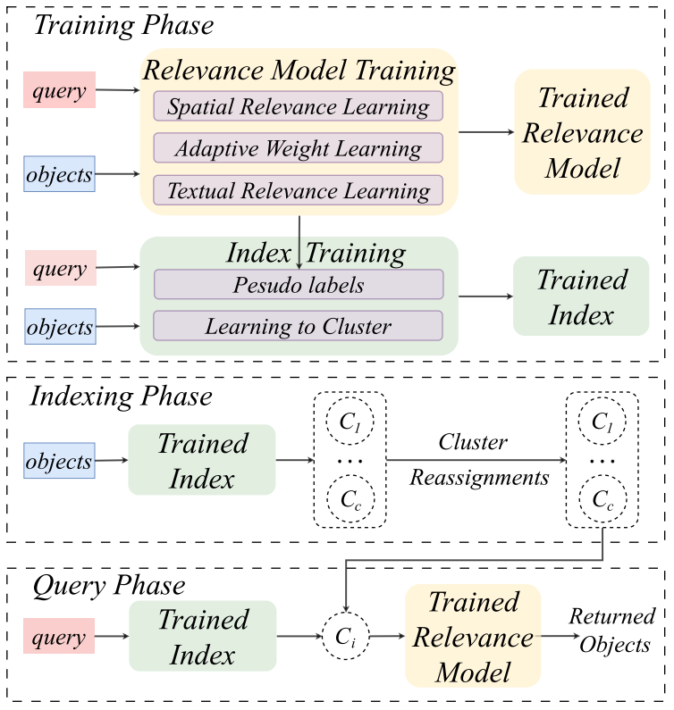

# LIST


### Code for paper 'LIST: Learning to Index Spatio-Textual Data for Dense Vectors based Spatial Keyword Queries'  

LIST is a novel solution, which learns to index spatio-textual data for answering dense vectors based spatial keyword queries effectively and efficently. It is featured with two novel conponents: First, it propose a lightweight and effective relevance model, which is based on dense retrieval models. Secondly, we introduce a novel machine learning based Approximate Nearest Neighbor Search (ANNS) index, which utilizes the learning-to-cluster technique to group relevant queries and objects together while separating irrelevant queries and objects.

### Requirements

* Python 3.8
* Pytorch 2.0.1
* transformers 4.10.2


### LIST
The following image depicts the workflow of LIST, which has three phases:  the training, indexing, and query phase. During the training phase, we first train our relevance model, and then we train our index.  During the indexing phase, each object is partitioned into one cluster. Note that our index is not limited to our proposed relevance model, and can also be applied for other embedding-based spatial-textual relevance models. During the query phase, the trained index routes each query to a cluster with the highest probability. In the cluster, k objects with the highest scores ranked by the trained relevance model are returned for the query.




### Datasets

We evaluate on the Beijing, Shanghai and Geo-Glue dataset.


### Testing

To test LIST-R on the Geo-Glue dataset.

```
python3 -m src.rank.inference  --checkpoint_file ./checkpoints/rank/geo-glue/checkpoint-file \
        --model_type bert-base-chinese --log_dir ./log/ --spatial_step_k 1000 --n_heads 2 \
        --per_gpu_batch_size 32 --origin_data_dir ./data/geo-glue/processed_data/ --device 1  \
        --output_dir ./data/geo-glue/processed_data/ --dataset geo-glue \
        --max_poi_length 96 --max_query_length 32
```
```
python3 -m src.rank.brute_search  --checkpoint_file ./checkpoints/rank/geo-glue/checkpoint-file \
        --model_type bert-base-chinese --log_dir ./log/ --output_dir ./data/geo-glue/processed_data/ \
        --spatial_step_k 1000 --n_heads 2 --device 3 --att_dropout 0\
        --embedding_dir ./data/geo-glue/processed_data/ --per_gpu_batch_size 32 \
        --origin_data_dir ./data/geo-glue/processed_data/ --topn 100 --dataset geo-glue
```

To test LIST on the Geo-Glue dataset.

```
python3 -m src.cluster.inference_l2c  --rank_checkpoint_file ./checkpoints/rank/geo-glue/checkpoint-file \
        --cluster_checkpoint_file  ./checkpoints/cluster/geo-glue/checkpoint-100-0.3053 --log_dir ./log/ \
        --device 0 --per_gpu_batch_size 32 --origin_data_dir ./data/geo-glue/processed_data/ --embedding_dir ./data/geo-glue/processed_data/ \
        --num_cluster 300 --hidden_dim 768 --num_layers 2 --dropout 0 --att_dropout 0 --n_heads 2 \
        --model_type bert-base-chinese --spatial_step_k 1000 --max_query_length 32 --max_poi_length 96 \
        --per_gpu_eval_batch_size 32 --min_cluster_size 0 --dataset geo-glue --min_precision 0
```

